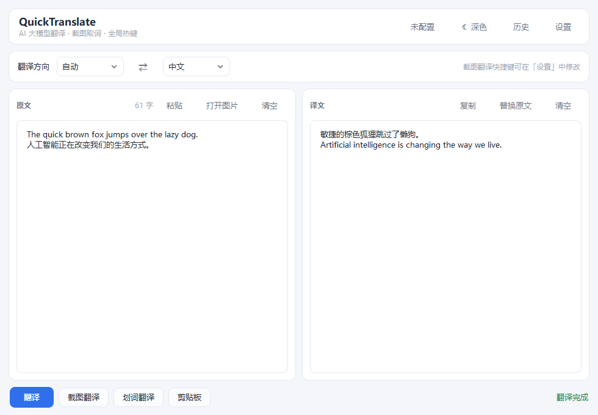
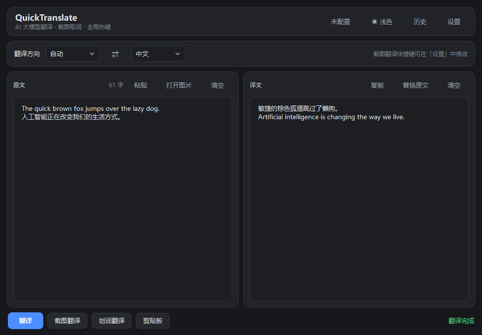
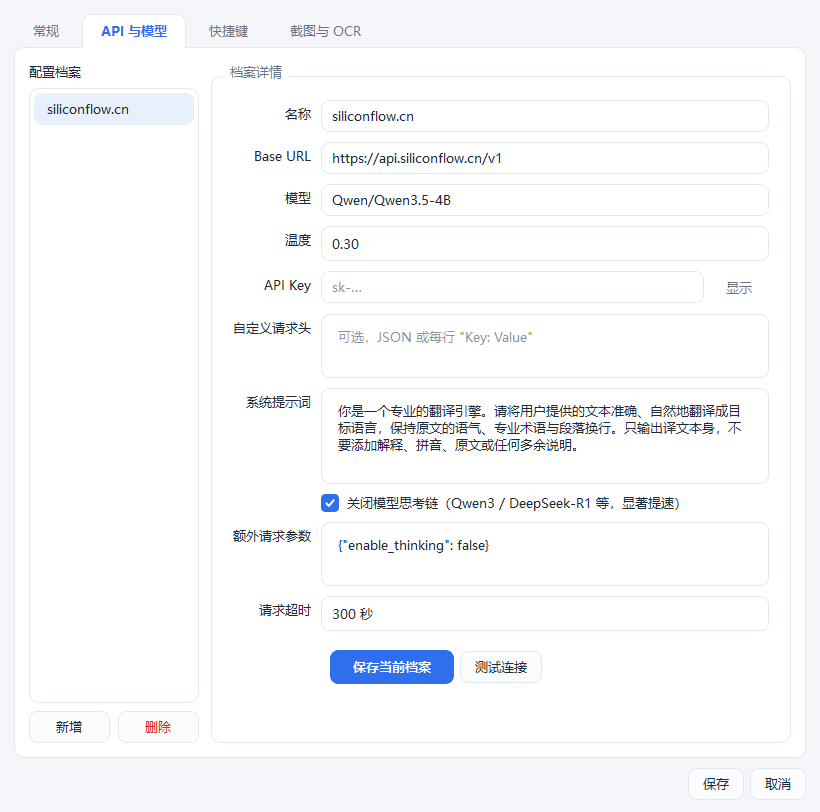
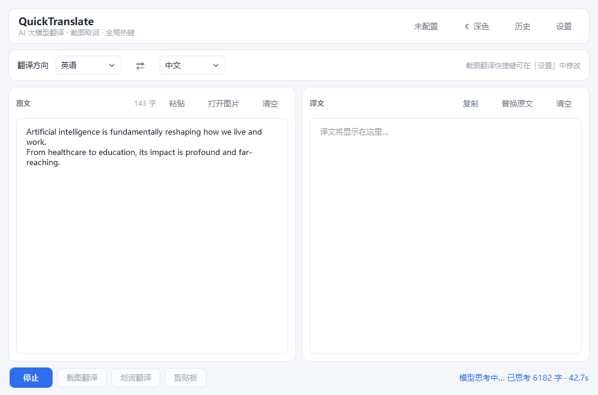

# QuickTranslate

一个用 Python + PySide6 写的桌面翻译工具：**AI 大模型翻译 + 本地 OCR 截图取词 + 全局热键**，界面参考常见词典软件的双栏布局，可打包成 Windows / macOS 独立程序。

## 功能

| 功能 | 说明 |
|---|---|
| AI 翻译 | 填写任意 **OpenAI 兼容** API（`base_url` / `api_key` / `model`），支持自定义请求头与系统提示词，译文**流式输出** |
| 截图翻译 | 全局热键 → 全屏框选 → 本地 OCR 识别 → 自动翻译，支持多显示器与高 DPI |
| 划词翻译 | 全局热键直接翻译当前选中的文本 |
| 剪贴板翻译 | 一键翻译剪贴板内容 |
| 多 API 档案 | 保存多组配置（不同服务商 / 模型）一键切换；API Key 存入系统凭据库 |
| 翻译历史 | SQLite 全文检索，可搜索、收藏、回填、复制 |
| 系统托盘 + 开机自启 | 关闭窗口缩到托盘后台常驻，快捷键随时可用 |
| 主题 | 浅色（默认）/ 深色一键切换 |

## 界面预览

| 浅色主题 | 深色主题 |
|---|---|
|  |  |

| 设置（API 与模型） | 翻译历史 |
|---|---|
|  |  |

思考型模型（Qwen3 / DeepSeek-R1 等）在思考阶段界面会有实时反馈，不会看起来像卡死：



## 思考型模型（重要）

Qwen3、DeepSeek-R1、GLM-Z1 这类**带思考链（reasoning）**的模型，在输出译文前会先"想"很久。
实测某些 4B 级思考型模型翻译一段百来字的英文，会先产出上万字的思考内容、
等将近一分钟才吐出第一个字。

本程序对这种情况做了三层处理：

1. **思考阶段实时可见**：状态栏显示 `模型思考中… 已思考 N 字 · Xs`，
   不会出现"一直卡在翻译中、毫无反应"；按钮同时变成 **停止**，可随时中断。
2. **一键关闭思考链**：设置 → API 与模型 → 勾选 **关闭模型思考链**。
   开启后首个译文通常在 1~3 秒内出现，译文质量基本无差别 —— 翻译并不需要推理。
   勾选后会在「额外请求参数」里写入 `{"enable_thinking": false}`。
3. **自动提示**：检测到模型名像思考型模型且尚未配置时，会替你把该选项勾上并给出说明，
   点「保存当前档案」生效。

若服务商不是用 `enable_thinking` 这个键（例如 vLLM 系的 `chat_template_kwargs`），
可以直接手写「额外请求参数」JSON，例如：

```json
{"chat_template_kwargs": {"enable_thinking": false}}
```

「请求超时」默认 **90 秒**（等待模型开始回话的最长时间，非整次请求总时长）。
关闭思考链后健康模型 1~3 秒就出字，90 秒足够宽松；若你使用思考型模型且不关闭思考链，
可以适当调大。

## 环境要求

- Python **3.13**（普通 CPython，**不要**用 3.13t free-threaded，PySide6 不完全支持）
- Windows / macOS / Linux

## 快速开始

```bash
# 1. 创建虚拟环境
python -m venv .venv
# Windows
.venv\Scripts\activate
# macOS / Linux
source .venv/bin/activate

# 2. 安装依赖
pip install -r requirements.txt

# 3. 下载离线 OCR 模型（可选但推荐，避免首次使用时联网下载）
python tools/prepare_ocr_models.py

# 4. 运行
python main.py
```

首次启动后点击右上角 **设置**：

1. 在「API 与模型」里填写 `Base URL`、`模型`、`API Key`，点 **测试连接** 确认可用；
2. 在「快捷键」里确认/修改全局热键（默认 `Ctrl+Shift+S` 截图、`Ctrl+Shift+T` 划词、`Ctrl+Shift+C` 剪贴板）；
3. 在「截图与 OCR」里选择识别语言（中英 / 日文）。

## 打包

Windows：

```powershell
powershell -ExecutionPolicy Bypass -File build\build.ps1
# 单文件便携版
powershell -ExecutionPolicy Bypass -File build\build.ps1 -OneFile
```

macOS / Linux：

```bash
bash build/build.sh
```

产物：

- 目录版：`dist/QuickTranslate/QuickTranslate.exe`（推荐，启动快、报错易定位）
- 单文件：`dist/QuickTranslate.exe`（启动较慢、易被杀软误报）
- macOS：`dist/QuickTranslate.app`（必须在 macOS 上构建）

> 实测（Windows + Python 3.13）目录版约 **300 MB**，内含中英 / 日文离线 OCR 模型，**断网可用**；
> `QuickTranslate.exe --selftest` 全部通过。

重新打包前建议先手动删除 `build/QuickTranslate` 与 `dist/QuickTranslate`，
否则 PyInstaller 清理旧产物时可能被系统的批量删除保护拦下。

## 项目结构

```
quicktranslate/
├── config/     # 路径、QSettings 偏好、多 API 档案（含 Key 安全存储）
├── core/       # 翻译客户端、本地 OCR、全局热键、截图、剪贴板、开机自启
├── workers/    # QThread 工作线程（流式翻译 / OCR），避免界面卡死
├── storage/    # SQLite 翻译历史（FTS5 全文检索）
├── ui/         # 主窗口、设置、历史、托盘、截图遮罩、结果浮层、主题
├── cli.py      # 命令行翻译（--translate，排错用）
├── selftest.py # 自检（依赖 / 路径 / OCR），打包后排查问题用
└── utils/      # 日志（打包后落盘）
build/          # PyInstaller spec 与打包脚本
tools/          # 图标生成、离线 OCR 模型下载
resources/      # OCR 模型与图标
docs/           # 界面截图
tests/          # 功能测试脚本
```

## 自检与排错

打包后如果某个功能不正常，先跑自检——它会逐项检查依赖导入、资源路径、OCR 模型与识别效果：

```bash
# 开发环境
python main.py --selftest

# 打包后（会弹窗显示结论，报告同时写到数据目录的 selftest.txt）
dist\QuickTranslate\QuickTranslate.exe --selftest
```

排查「翻译没反应 / 卡住」时用命令行翻译，它会打印思考耗时与首译文延迟：

```bash
dist\QuickTranslate\QuickTranslate.exe --translate "Hello, world!"
# 临时关闭思考链对比
dist\QuickTranslate\QuickTranslate.exe --translate "Hello, world!" --no-think
# 结果同时写入 %APPDATA%\QuickTranslate\last_translate.txt
```

数据目录（配置 / 历史 / 日志 / 自检报告）：

- Windows：`%APPDATA%\QuickTranslate\`
- macOS：`~/Library/Application Support/QuickTranslate/`
- Linux：`~/.config/QuickTranslate/`

常见现象对照：

| 现象 | 原因 | 处理 |
|---|---|---|
| 截图/图片翻译提示「OCR 引擎不可用」 | 依赖缺失或模型文件不全 | 跑 `--selftest` 看具体哪项 FAIL |
| 启动后状态栏红色提示未配置 API | 还没填 API Key | 设置 → API 与模型 |
| 全局热键无效 | 被其他软件占用 | 换组合键；macOS 需授权「辅助功能」 |
| 划词翻译「没反应 / 未取到文字」 | 热键的 Alt/Ctrl/Shift 还按着时注入 Ctrl+C 会失效；或目标程序以管理员权限运行 | 松开修饰键再按一次（程序会自动等）；管理员权限的程序请改用「截图翻译」 |
| 首次截图等很久 | 正在加载 OCR 模型 | 启动后会自动后台预热 |
| 长时间显示「模型思考中…」 | 用的是思考型模型 | 见上文「思考型模型」，勾选关闭思考链 |
| 等待很久后提示超时 | 思考型模型思考时间超过超时值 | 调大「请求超时」，或关闭思考链 |

`--selftest` 里有一节「划词取词」：

- 前半段不依赖前台窗口（验证"能查到按下的修饰键"与"注入前会等修饰键松开"），任何时候都能跑；
- 后半段会**短暂弹出一个自检窗口**（约 1 秒）做端到端实测 —— 划词靠的是
  "往当前前台程序发 Ctrl+C"，没有真实的前台窗口就无从验证。
  **桌面锁定时会自动跳过这一项**（不算失败），解锁后重跑即可。

另外 `tools/check_selection.py` 可以单独细查划词链路（会起一个独立进程的窗口当目标）：

```bash
.venv/Scripts/python.exe tools/check_selection.py
```

## 常见问题

**全局快捷键无效？**
可能被其他软件占用，换一个组合键。macOS 需要在「系统设置 → 隐私与安全性 → 辅助功能」中授权本应用。

**截图识别不准？**
在设置里把「识别语言」切到与画面一致（中文模型同时支持英文；日文需切换）。

**划词翻译取不到文字？**
先把要翻译的文字选中，再按热键；按热键时**把 Alt/Ctrl/Shift 完全松开**——程序会在注入 Ctrl+C 前自动等待松开，但一直按住不放就会复制失败（系统会把 Ctrl+C 合成为 Ctrl+Shift+C，目标程序不认）。若目标程序以管理员权限运行，Windows 会拦截按键注入，这种情况请改用「截图翻译」。失败时界面会弹出说明，不再静默。

**首次截图等很久？**
OCR 模型需要加载，程序启动后会在后台预热；若未下载离线模型，首次会联网拉取。

**API 报错？**
先点「测试连接」。多数是 `Base URL` 少了 `/v1`、模型名不对或 Key 无效。本程序统一走 **Chat Completions** 接口，兼容各类中转/自建服务（含 Ollama 等）。

## 说明

### 数据与密钥存放

| 内容 | 位置 |
|---|---|
| API Key | 系统凭据库（Windows 凭据管理器 / macOS 钥匙串 / Linux libsecret） |
| API Key（降级） | `<数据目录>/keys.json` —— **仅在凭据库不可用时生成** |
| 模型参数 | `<数据目录>/profiles.json`（明文 JSON，**不含** Key） |

> **关于降级存储**：凭据库不可用时，Key 会写入 `keys.json`，采用
> 与机器名 / 用户名绑定的**混淆**编码。**这不是加密** —— 拿到该文件的人
> 结合本仓库源码可以还原出原始 Key。它只用于避免密钥以明文形式直接暴露，
> 请勿将 `keys.json` 分享或提交到版本库。

### 其他

- 本地 OCR 使用 [RapidOCR](https://github.com/RapidAI/RapidOCR)（Apache-2.0），模型版权归百度 PaddleOCR。
  模型文件体积较大，未纳入版本库，由 `tools/prepare_ocr_models.py` 下载。

## 许可证

本项目以 **MIT License** 发布，详见 [LICENSE](LICENSE)。

第三方依赖及其许可证：

| 依赖 | 许可证 |
|---|---|
| [PySide6](https://www.qt.io/qt-for-python) | LGPL-3.0（或 GPL / 商业许可） |
| [pynput](https://github.com/moses-palmer/pynput) | LGPL-3.0 |
| [RapidOCR](https://github.com/RapidAI/RapidOCR) | Apache-2.0 |
| [ONNX Runtime](https://github.com/microsoft/onnxruntime) | MIT |
| [openai-python](https://github.com/openai/openai-python) | Apache-2.0 |
| [NumPy](https://numpy.org/) | BSD-3-Clause |
| [Pillow](https://python-pillow.org/) | MIT-CMU |
| [keyring](https://github.com/jaraco/keyring) | MIT |
| [pyperclip](https://github.com/asweigart/pyperclip) | BSD-3-Clause |

> 打包分发时请一并遵守上述依赖的许可证条款。PySide6 与 pynput 采用 LGPL，
> 本项目以动态链接方式使用，未修改其源码。
